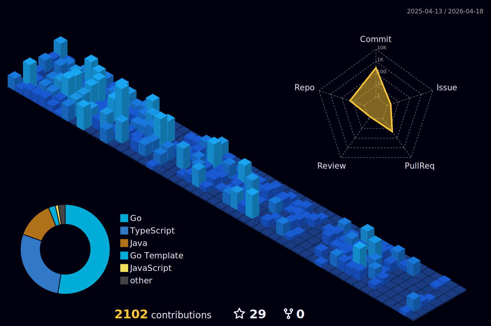

<h1 align="center">Hi 👋, I'm Giovani</h1>

## 🧑‍💻 About Me:
- 🌍 Brazilian, 21 years old
- 💼 Back-end developer
- 🚀 Passionate about learning new technologies and solving problems

---

## 🔧 Tech Stack:

  
  
  
  
  
  
  
  
  
  
  

---

## 📊 GitHub Stats:

 
  

  
 |  |  |  
 | ----------- | ----------- |

##
   

     
  

  
---

  <h3>Thank you for visiting! 😁</h3>
  
🚀 LkGiovani 🚀

