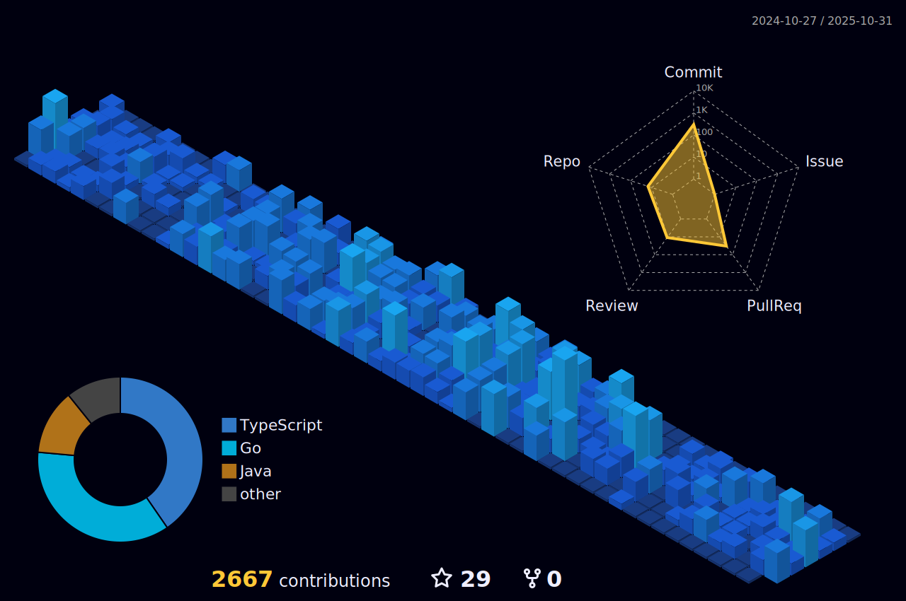

<h1 align="center">Hi 👋, I'm Giovani</h1>

  Brazilian • 22 years old • Software Engineer 
  Backend (Go/Node/Bun) • Distributed Systems • AWS

  <a href="https://portfolio.lkgiovani.com/" target="_blank" rel="noreferrer">Portfolio</a> •
  <a href="https://www.linkedin.com/in/lkgiovani/" target="_blank" rel="noreferrer">LinkedIn</a> •
  <a href="https://github.com/lkgiovani" target="_blank" rel="noreferrer">GitHub</a> •
  <a href="mailto:lkgiovani.dev@gmail.com" target="_blank" rel="noreferrer">Email</a>

---

## 🧑‍💻 About Me

- 💼 Software Engineer focused on back-end (Golang + Node.js/TypeScript/Bun)
- 🧩 Microservices, Serverless, Event-driven, Real-time processing
- ☁️ AWS, Observability, CI/CD, Docker/Kubernetes

---

## 🔧 Technologies

 

  
  
  
  
  
  
  
  
  
  
  
  
  
  
  
  
  
  
  
  
  
  
  
  
  
  
  
  
  
  
  
  
  
  
  
  
  
  
  
  
  
  
  
  
  
  
  
  
  
  
  
  
  
  
  
  
  
  
  
  
  
  
  

---

## 📊 GitHub Stats:

 
  

  
 |  |  |  
 | ----------- | ----------- |

  
---

